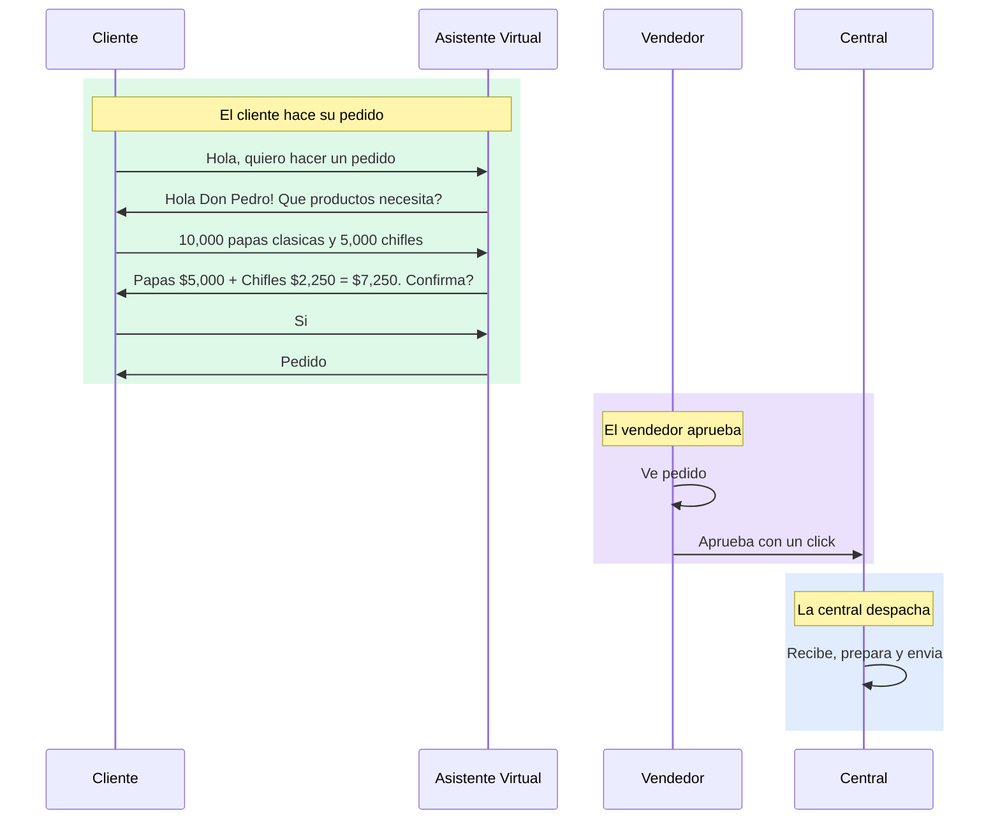
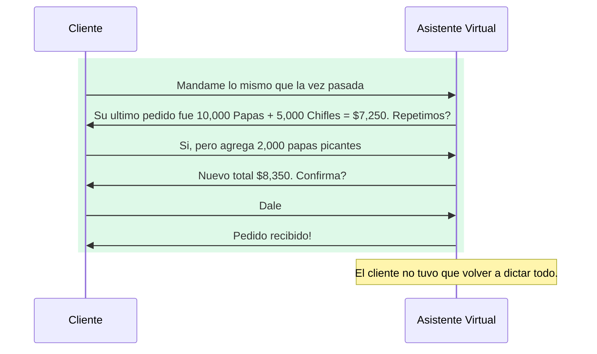
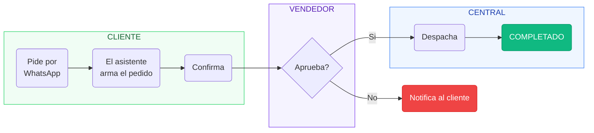
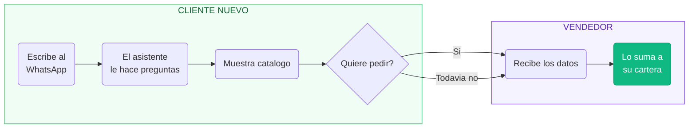
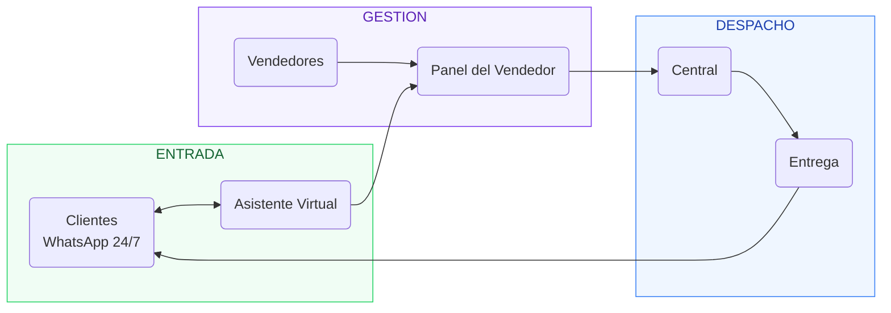

# Asistente Virtual para WhatsApp

---

## 1. Asi se ve un pedido por WhatsApp

> El cliente pide por WhatsApp, el asistente arma el pedido, el vendedor aprueba y la central despacha.

---

## 2. El asistente recuerda a cada cliente

> Cuando un cliente vuelve a pedir, no necesita repetir nada. El asistente recuerda su historial.

---

## 3. Flujo de un Pedido

> El pedido pasa por 3 etapas: el cliente pide, el vendedor aprueba, la central despacha.

---

## 4. Cuando llega un cliente nuevo

> Si un numero desconocido escribe, el asistente lo atiende, recopila sus datos y lo asigna a un vendedor.

---

## 5. Vision General

> Todo el sistema conectado: del cliente al despacho, en un solo flujo.

---

## Beneficios

> Tu negocio funciona 24/7 sin perder un solo pedido.

| Sin el asistente | Con el asistente |
|---|---|
| Pedidos se pierden o confunden | Cada pedido queda registrado |
| El vendedor anota mal cantidades | El sistema calcula con el catalogo |
| La central recibe info incompleta | Recibe pedidos completos y aprobados |
| No hay historial por cliente | Historial completo por cliente |
| Solo se puede pedir en horario laboral | Los clientes piden 24/7 |
| El vendedor depende de su memoria | Todo queda en el sistema |
| No se sabe que se vendio en tiempo real | La central ve todo al instante |
| Clientes nuevos esperan al vendedor | El asistente los captura automaticamente |
