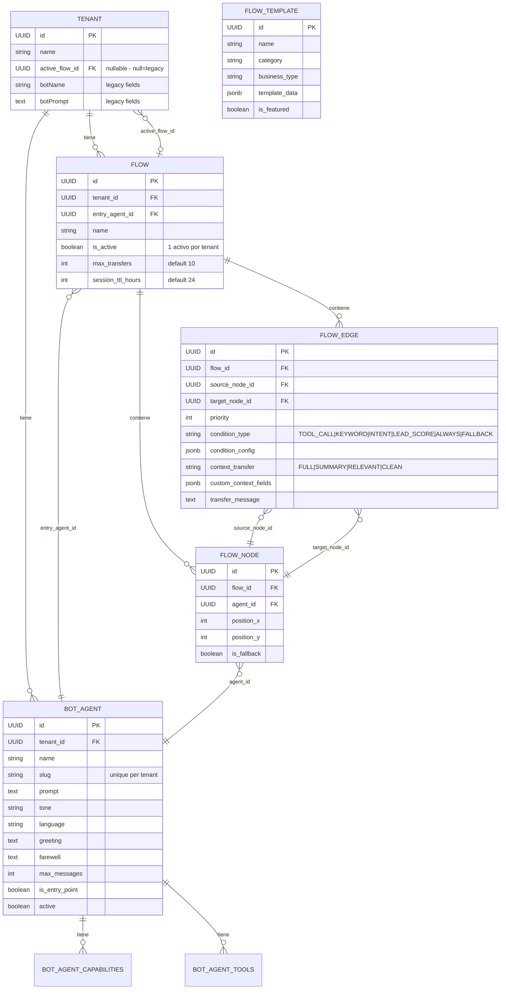
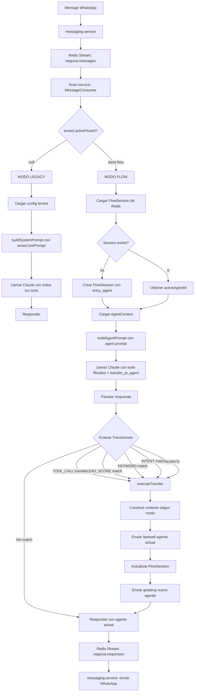
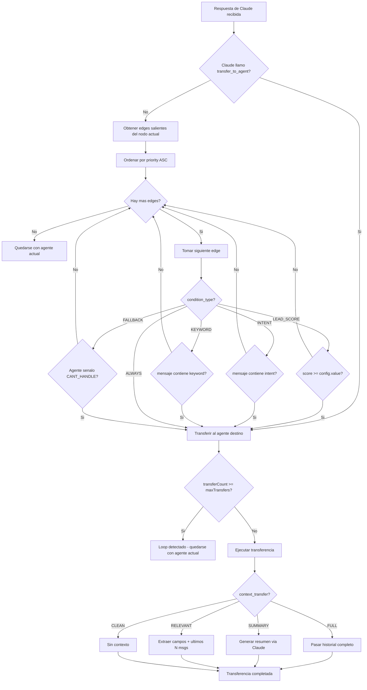
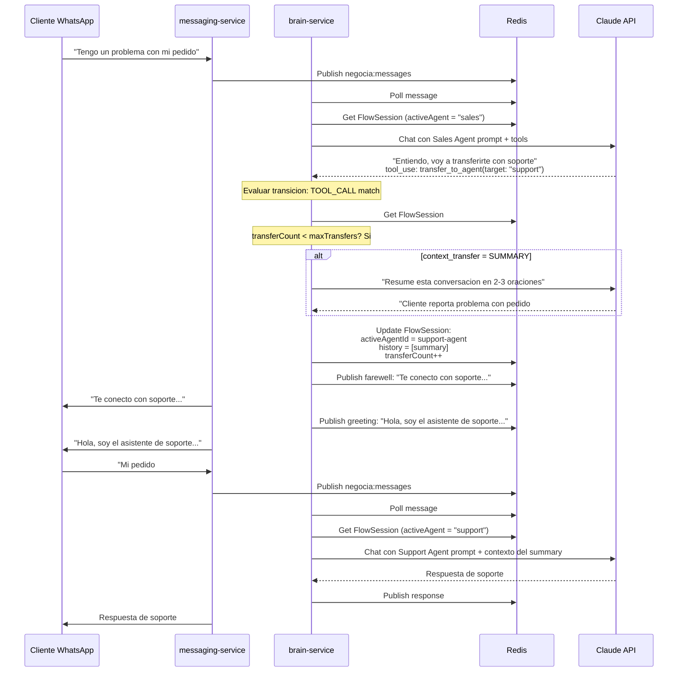
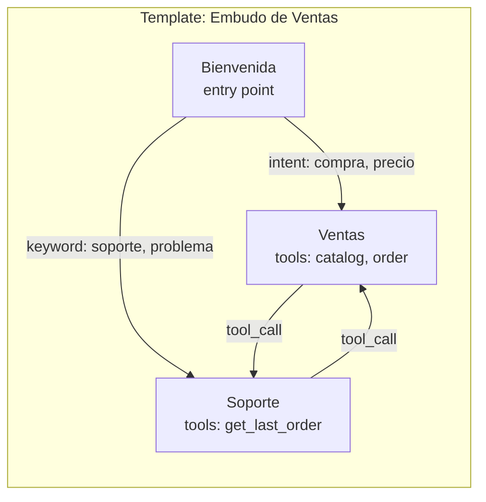
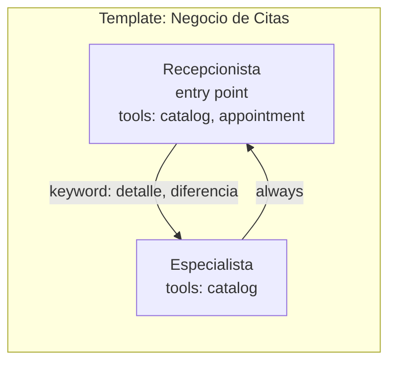
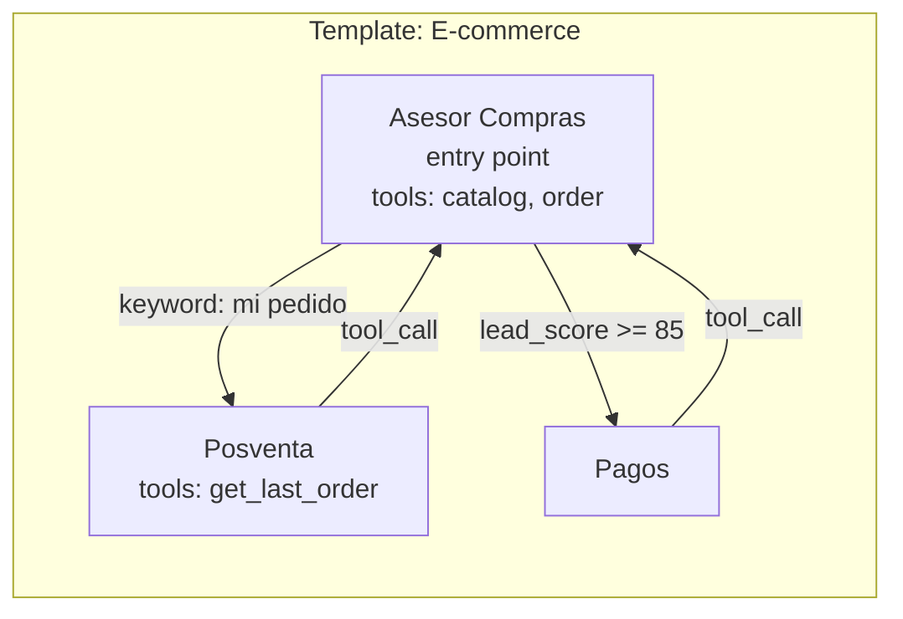
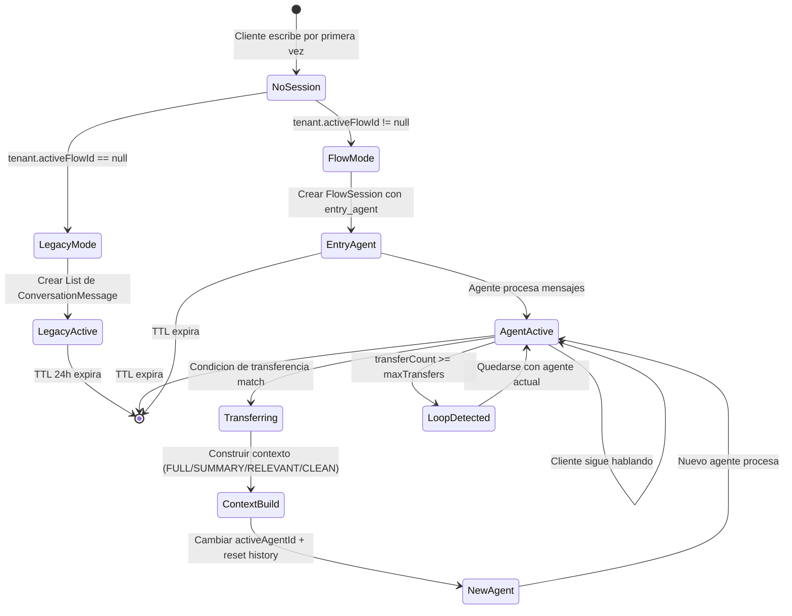
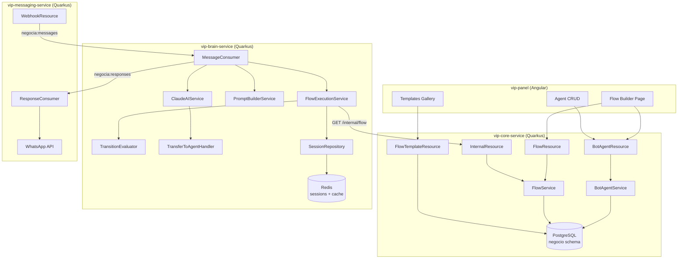

## Contexto

  

Hoy 1 tenant = 1 bot. La config del bot (nombre, prompt, tono, tools) vive en la entidad `Tenant`. El usuario quiere que cada negocio pueda tener **multiples agentes IA** conectados en un flujo (grafo), donde cada agente se especializa en algo (ventas, soporte, citas, etc.) y puedan transferir conversaciones entre si.

  

**Modelo hibrido**: Templates predefinidos como punto de partida, pero el usuario puede editar el grafo libremente (agregar/quitar nodos, cambiar conexiones). Contexto entre bots configurable por conexion.

  

**Alcance**: Solo diseno, no implementacion por ahora.

  

---

  

## 0. Diagramas de Arquitectura

  

### Diagrama ER - Modelo de Datos

  



  

### Diagrama de Flujo - Pipeline de Procesamiento de Mensajes

  



  

### Diagrama de Flujo - Evaluacion de Transiciones

  



  

### Diagrama de Secuencia - Transferencia entre Agentes

  



  

### Diagrama - Templates de Flujo

  



  



  



  

### Diagrama - Estado de Session en Redis

  



  

### Diagrama de Componentes - Arquitectura de Microservicios

  



  

---

  

## 1. Modelo de Datos

  

### BotAgent (negocio.bot_agents)

| Campo | Tipo | Descripcion |

|-------|------|-------------|

| id | UUID PK | |

| tenant_id | UUID FK -> tenants | |

| name | VARCHAR(100) | "Asistente de Ventas" |

| slug | VARCHAR(50) | "sales-agent" (unique per tenant) |

| prompt | TEXT | System prompt del agente |

| tone | VARCHAR(50) | Default 'profesional' |

| language | VARCHAR(5) | Default 'es' |

| greeting | TEXT | Mensaje al tomar la conversacion |

| farewell | TEXT | Mensaje al transferir |

| max_messages | INT | Default 50 |

| is_entry_point | BOOLEAN | Puede ser el primer agente |

| active | BOOLEAN | Soft delete |

| created_at / updated_at | INSTANT | |

  

**Tablas join**: `bot_agent_capabilities` (agente + capability enum), `bot_agent_tools` (agente + tool_name string)

  

### Flow (negocio.flows)

| Campo | Tipo | Descripcion |

|-------|------|-------------|

| id | UUID PK | |

| tenant_id | UUID FK | |

| name | VARCHAR(200) | "Flujo Principal" |

| description | TEXT | |

| entry_agent_id | UUID FK -> bot_agents | Agente inicial |

| is_active | BOOLEAN | Solo 1 activo por tenant |

| max_transfers | INT | Default 10 (anti-loop) |

| session_ttl_hours | INT | Default 24 |

| created_at / updated_at | INSTANT | |

  

### FlowNode (negocio.flow_nodes)

| Campo | Tipo | Descripcion |

|-------|------|-------------|

| id | UUID PK | |

| flow_id | UUID FK -> flows ON DELETE CASCADE | |

| agent_id | UUID FK -> bot_agents | |

| position_x / position_y | INT | Para editor visual futuro |

| is_fallback | BOOLEAN | Nodo fallback global |

  

### FlowEdge (negocio.flow_edges)

| Campo | Tipo | Descripcion |

|-------|------|-------------|

| id | UUID PK | |

| flow_id | UUID FK -> flows ON DELETE CASCADE | |

| source_node_id | UUID FK -> flow_nodes | |

| target_node_id | UUID FK -> flow_nodes | |

| priority | INT | Menor = evalua primero |

| condition_type | VARCHAR(30) | TOOL_CALL, KEYWORD, INTENT, LEAD_SCORE, ALWAYS, FALLBACK |

| condition_config | JSONB | Config especifica del tipo |

| context_transfer | VARCHAR(20) | FULL, SUMMARY, RELEVANT, CLEAN |

| custom_context_fields | JSONB | Para modo RELEVANT |

| transfer_message | TEXT | Mensaje durante transferencia |

  

### FlowTemplate (negocio.flow_templates)

| Campo | Tipo | Descripcion |

|-------|------|-------------|

| id | UUID PK | |

| name | VARCHAR(200) | |

| description | TEXT | |

| category | VARCHAR(50) | SALES, SUPPORT, APPOINTMENTS, ECOMMERCE |

| business_type | VARCHAR(20) | SERVICES, PRODUCTS, MIXED o NULL |

| template_data | JSONB | Definicion completa (agents[], edges[]) |

| is_featured | BOOLEAN | |

  

### Cambio en Tenant

Agregar campo nullable `active_flow_id UUID` -> cuando es NULL, funciona como hoy (single-bot legacy).

  

---

  

## 2. Session State

  

El key Redis `session:{tenantId}:{phone}` cambia de `List<ConversationMessage>` a:

  

```

FlowSession {

activeAgentId: UUID | null // null = legacy mode

activeFlowId: UUID | null

history: ConversationMessage[]

agentHistory: AgentVisit[] // breadcrumb de transferencias

transferCount: int // proteccion anti-loop

startedAt: Instant

}

  

AgentVisit {

agentId, agentName, enteredAt, exitReason

}

```

  

**Backward compat**: SessionRepository detecta formato (array = legacy, object = nuevo). Sessions existentes siguen funcionando sin migracion.

  

---

  

## 3. Motor de Ejecucion (brain-service)

  

### Pipeline modificado

```

Mensaje entrante

-> resolveAgent(tenantId, phone)

-> Si tenant.activeFlowId == null: modo legacy (sin cambios)

-> Si tiene flow: cargar FlowSession, obtener agente activo

-> buildAgentPrompt(agentContext) // usa prompt/tone/tools del agente

-> getHistory() // historial del agente actual

-> callAI(tools filtrados por agente + transfer_to_agent)

-> evaluateTransitions() // evaluar si hay que transferir

-> Si hay transferencia: executeTransfer()

```

  

### Evaluacion de transiciones (por prioridad)

1. **TOOL_CALL**: Claude llamo `transfer_to_agent(targetSlug, reason)` -- maxima prioridad

2. **LEAD_SCORE**: `{ "operator": ">=", "value": 80 }` -- evaluado contra tag `[LEAD:true:SCORE]`

3. **INTENT**: `{ "intents": ["support", "complaint"] }` -- match por frases/keywords del mensaje

4. **KEYWORD**: `{ "keywords": ["soporte", "ayuda"] }` -- contains case-insensitive

5. **ALWAYS**: Sin condicion, siempre transfiere (para agentes one-shot)

6. **FALLBACK**: Solo cuando el agente no puede manejar el request

  

### Tool transfer_to_agent

```json

{

"name": "transfer_to_agent",

"input_schema": {

"properties": {

"target_agent": { "type": "string", "enum": ["sales", "support"] },

"reason": { "type": "string" }

}

}

}

```

El `enum` se genera dinamicamente con los slugs de los agentes destino (edges salientes del nodo actual). Asi Claude solo puede transferir a destinos validos.

  

---

  

## 4. Transferencia de Contexto

  

Configurable **por conexion** (campo `context_transfer` en FlowEdge):

  

| Modo | Comportamiento | Costo |

|------|---------------|-------|

| **FULL** | Pasa todo el historial | Alto (mas tokens) |

| **SUMMARY** | Genera resumen via Claude (2-3 oraciones) y lo pasa | Medio (+1 llamada Claude corta) |

| **RELEVANT** | Extrae campos especificos + ultimos N mensajes | Medio |

| **CLEAN** | Sin contexto, empieza de cero | Bajo |

  

### Flujo de transferencia

1. Evaluar transicion -> TransitionResult

2. Si `shouldTransfer`:

- Construir contexto segun modo configurado

- Enviar farewell del agente actual (si tiene)

- Actualizar FlowSession (cambiar activeAgentId, agregar AgentVisit, reemplazar history)

- Enviar greeting del nuevo agente (si tiene)

  

---

  

## 5. Edge Cases

  

| Caso | Solucion |

|------|----------|

| Agente destino eliminado | Fallback al entry agent del flow, log warning |

| Loop circular de transfers | `transferCount` vs `maxTransfers` (default 10), se queda en agente actual |

| Agente eliminado en sesion activa | Reset a entry agent, preservar historial |

| Cliente vuelve despues de 24h | Session TTL expira, empieza de cero desde entry agent |

| Mensajes concurrentes durante transfer | Lock Redis `processing:{tenantId}:{phone}` con EX 30s |

| Flow desactivado mid-conversacion | Sesiones activas siguen con ultimo agente, nuevas usan legacy |

  

---

  

## 6. API Endpoints

  

### BotAgent CRUD: `/api/core/agents`

- `POST /` - Crear agente

- `GET /` - Listar agentes del tenant

- `GET /{id}` - Obtener agente

- `PUT /{id}` - Actualizar

- `DELETE /{id}` - Soft delete

  

### Flow CRUD: `/api/core/flows`

- `POST /` - Crear flow

- `GET /` - Listar flows del tenant

- `GET /{id}` - Obtener con nodos y edges

- `PUT /{id}` - Actualizar metadata

- `DELETE /{id}` - Eliminar

- `POST /{id}/activate` - Activar flow

- `POST /{id}/deactivate` - Desactivar (volver a single-bot)

- `POST /{id}/nodes` - Agregar nodo

- `DELETE /{id}/nodes/{nodeId}` - Quitar nodo

- `POST /{id}/edges` - Agregar conexion

- `PUT /{id}/edges/{edgeId}` - Editar conexion

- `DELETE /{id}/edges/{edgeId}` - Quitar conexion

- `POST /{id}/validate` - Validar flow (entry point, orphans, etc.)

  

### Templates: `/api/core/flow-templates`

- `GET /` - Listar templates

- `GET /{id}` - Detalle

- `POST /{id}/clone` - Clonar al tenant

  

### Internal: `/internal/flow/{tenantId}/active`

- `GET` - Flow activo con agentes y edges (para brain-service)

  

---

  

## 7. Frontend (vip-panel)

  

### Nuevas paginas

- **Flow Builder** (`features/flow-builder/flow-builder.ts`): 3 tabs - Agentes (cards), Conexiones (tabla), Preview (diagrama simple)

- **Agent CRUD**: Slide-over con campos: nombre, slug, prompt, tono, greeting, farewell, tools (checkboxes), capabilities (checkboxes)

- **Templates Gallery**: Grid de cards por categoria, boton "Usar template"

- **Sidebar**: Nuevo item "Flow Builder" con icono `fa-diagram-project` (solo tenant_admin)

  

---

  

## 8. Templates Predefinidos

  

### Embudo de Ventas (SALES)

```

[Bienvenida] --intent:compra--> [Ventas] --keyword:problema--> [Soporte]

\--keyword:soporte--> [Soporte] \--tool_call--> [Soporte]

```

  

### Negocio de Citas (APPOINTMENTS)

```

[Recepcionista] --keyword:detalle--> [Especialista] --always--> [Recepcionista]

```

  

### E-commerce (ECOMMERCE)

```

[Asesor Compras] --keyword:mi_pedido--> [Posventa]

\--lead_score>=85--> [Pagos]

```

  

---

  

## 9. Backward Compatibility

  

- `Tenant.activeFlowId == null` -> sistema legacy, sin cambios

- `SessionRepository` detecta formato automaticamente (array vs object)

- Cero migracion de datos existentes

- El usuario activa flows cuando quiera, puede desactivar para volver a single-bot

  

---

  

## 10. Archivos Criticos a Modificar

  

### vip-core-service

- `domain/entity/Tenant.java` - Agregar `activeFlowId`

- Nuevas entidades: `BotAgent.java`, `Flow.java`, `FlowNode.java`, `FlowEdge.java`, `FlowTemplate.java`

- Nuevos repositories y services

- Nuevos resources: `BotAgentResource`, `FlowResource`, `FlowTemplateResource`

- Nuevo endpoint interno en `InternalResource` o separado

  

### vip-brain-service

- `stream/MessageConsumer.java` - Agregar resolucion de agente y evaluacion de transiciones

- `repository/SessionRepository.java` - FlowSession con backward compat

- `ai/PromptBuilderService.java` - Nuevo metodo `buildAgentPrompt()`

- `ai/ClaudeAIService.java` - Tools filtrados + tool `transfer_to_agent` dinamico

- Nuevos: `FlowExecutionService`, `TransitionEvaluator`, `TransferToAgentHandler`

  

### vip-panel

- Nuevas paginas en `features/flow-builder/`

- Nuevos metodos en `api.service.ts`

- Nuevas rutas en `app.routes.ts`

- Nuevo item en sidebar

  

---

  

## 11. Verificacion

  

Cuando se implemente, probar:

1. Tenant sin flow -> debe funcionar exactamente como hoy

2. Crear flow desde template -> clonar agentes y conexiones

3. Activar flow -> nuevas conversaciones empiezan con entry agent

4. Transfer por tool_call -> Claude llama transfer_to_agent, cambia agente

5. Transfer por keyword -> mensaje con "soporte" activa transferencia

6. Context SUMMARY -> verificar que el resumen llega al nuevo agente

7. Context CLEAN -> nuevo agente no tiene historial previo

8. Loop protection -> verificar que despues de maxTransfers se detiene

9. Agente eliminado -> fallback a entry agent sin crash

10. Desactivar flow -> nuevas conversaciones usan single-bot legacy