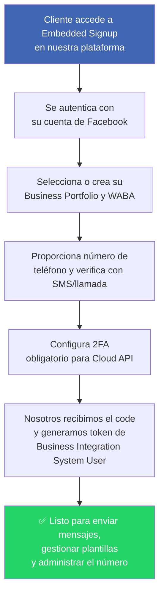

## 1. Configuración inicial (solo se realiza una vez)

### Paso 1

![[Pasted image 20260423225957.png]]

### Paso 2

![[Pasted image 20260423231735.png]]

### Paso 3 — Generar token permanente

El token permanente se genera ingresando al siguiente link:

https://business.facebook.com/latest/settings/system_users?business_id=960855130455533&selected_user_id=61573236428027

![[Pasted image 20260423232628.png]]

## 2. Onboarding de un nuevo cliente

### Requisitos del Tech Provider (nosotros - ya completado)

- ✅ Business Verification de nuestra empresa
- ✅ App Review aprobado
- ✅ App en modo Live
- ✅ Dominio verificado
- ✅ Facebook Login for Business con Embedded Signup habilitado
- ✅ Permisos: `whatsapp_business_management` y `whatsapp_business_messaging`
- ✅ System User de tipo Business Integration

### ¿Qué necesitamos del cliente?

**Mínimo (para empezar):**
- Cuenta de Facebook personal (para autenticarse en Embedded Signup)
- Un número de teléfono que **no esté registrado** en WhatsApp
- Poder recibir un código de verificación (SMS o llamada) en ese número

> **Nota:** El cliente NO necesita tener un Business Portfolio (Business Manager) previamente. Se crea automáticamente durante el Embedded Signup.

**Limitaciones sin Business Verification:**
- Máximo 2 números de teléfono registrados
- Límite de 250 conversaciones/día inicialmente

**Ideal (para escalar):**
- Todo lo anterior +
- Business Verification completada (nombre legal, dirección, teléfono, sitio web)
- Esto desbloquea hasta 20 números y los límites de mensajería escalan automáticamente

### Diagrama general

```
┌─────────────────────────────────────────────┐
│         VENTIX (Tech Provider)              │
│                                             │
│  ✅ Business Verification                   │
│  ✅ App Review + Modo Live                  │
│  ✅ Embedded Signup habilitado              │
│  ✅ System User (Business Integration)      │
└──────────────────┬──────────────────────────┘
                   │ Embedded Signup
       ┌───────────┼───────────┐
       ▼           ▼           ▼
┌────────────┐┌────────────┐┌────────────┐
│ Cliente 1  ││ Cliente 2  ││ Cliente 3  │
│            ││            ││            │
│ MÍNIMO:    ││ MÍNIMO:    ││ MÍNIMO:    │
│ ✅ Facebook││ ✅ Facebook││ ✅ Facebook│
│ ✅ Número  ││ ✅ Número  ││ ✅ Número  │
│ ✅ SMS/Lld ││ ✅ SMS/Lld ││ ✅ SMS/Lld │
│            ││            ││            │
│ IDEAL:     ││ IDEAL:     ││ IDEAL:     │
│ ⭐ BV      ││ ⭐ BV      ││ ⭐ BV      │
│ (escala    ││ (escala    ││ (escala    │
│  límites)  ││  límites)  ││  límites)  │
└────────────┘└────────────┘└────────────┘
```

### Flujo de alta de un nuevo número



1. El cliente accede al flujo de **Embedded Signup** integrado en nuestra plataforma
2. Se autentica con su cuenta de Facebook
3. Selecciona o crea su Business Portfolio y WABA (WhatsApp Business Account)
4. Proporciona el número de teléfono y lo verifica con código SMS/llamada
5. Se configura 2FA (obligatorio para Cloud API)
6. Nosotros recibimos el code y lo intercambiamos por un token de Business Integration System User
7. Con ese token ya podemos enviar mensajes, gestionar plantillas y administrar el número

> **Importante:** El número debe registrarse dentro de los **14 días** posteriores al Embedded Signup. Si no, se debe repetir el flujo.
